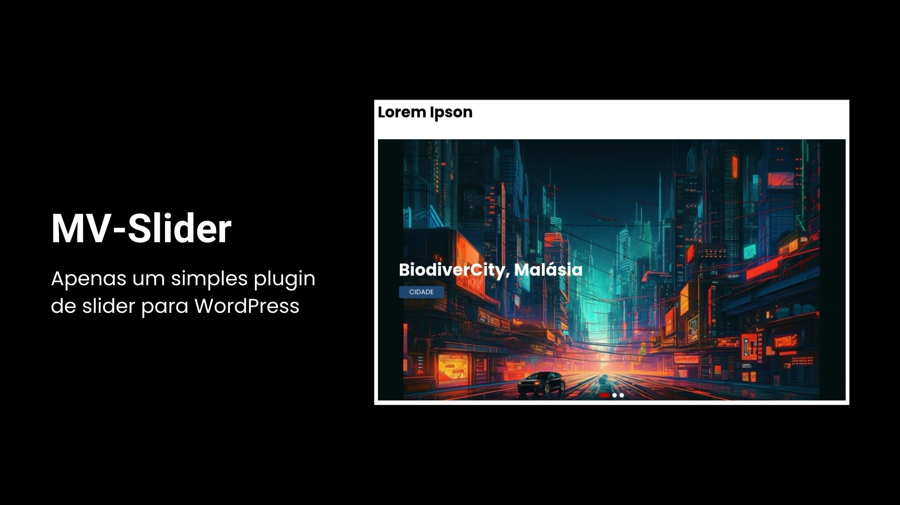
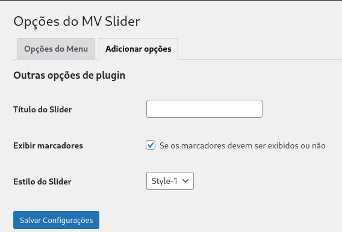
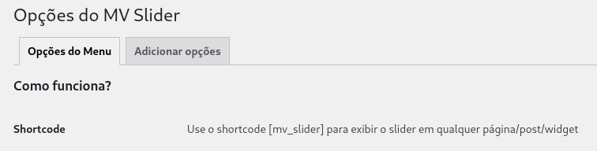
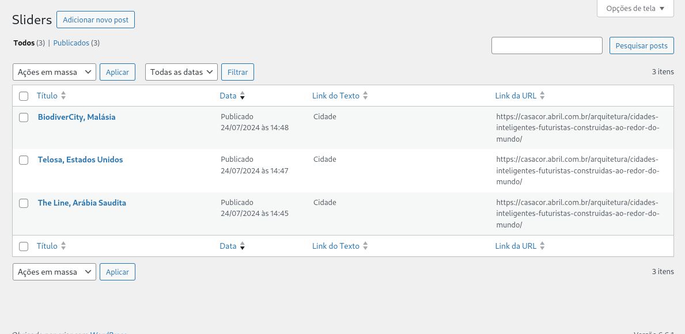

# MV - Slider

Este plugin foi desenvolvido durante o curso "Criação de Plugins WordPress do Jeito Certo", ministrado pelo professor Marcelo Xavier Vieira.

[Link para o curso](https://www.udemy.com/course/crie-plugins-wordpress-do-jeito-certo/?couponCode=ST3MT72524)

Este é um plugin de slider simples e básico, mas que cumpre eficientemente sua função.

## Índice

- [Funcionalidades](#funcionalidades)

## Funcionalidades

#### Tela de configurações

Aqui é possível realizar todas as configurações básicas do slider, como alterar
o título, padrão e exibir os marcadores no slider.

#### Shortcode (para exibir o slider)

#### Cadastro de novos sliders

